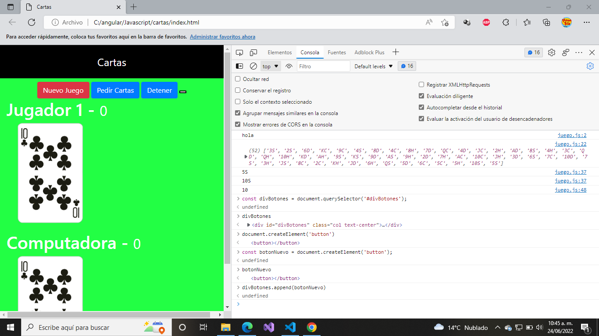
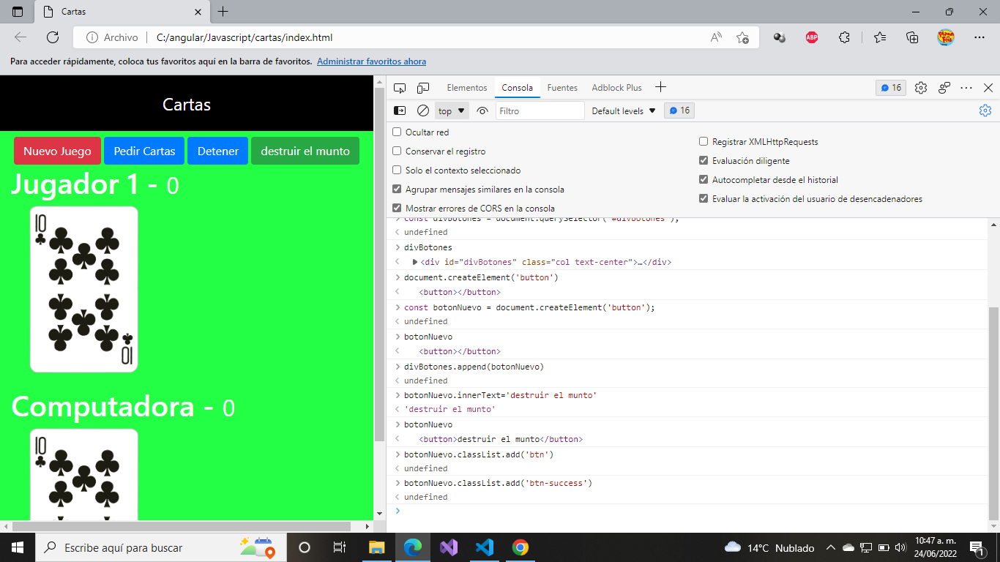
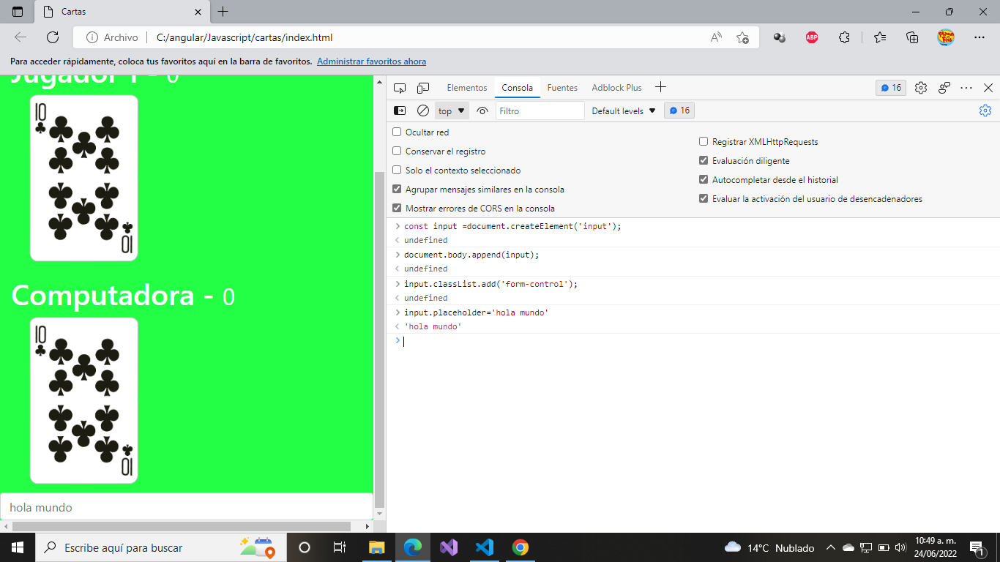

# Realizar proyecto con cartas, haciendo la logica con javascript.

Se crea las carpetas correspondientes assets.

Se utiliza boostrap para los estilos principales, como por botones.

Se utiliza una libreria extra, la cual nos sirve para realizar los numeros aleatorios.

https://underscorejs.org

# DOM:

 document object Model

Se selecciona el documento bajo la direccion de document.

document.querySelector('small').innerHTML='`<b>`hola `</b>`'

document.querySelector('.carta');

document.getElementsByClassName('carta');

**document**.**querySelector**(**'header'**).**innerText**=**'jesus'**;

document.querySelector('.titulo').innerText='jesus';

const titulo = document.querySelector('titulo');

***=>  manipulacion del DOM agregando un boton***

Manipulacion del DOM agregando los estilos correspondientes.

creando un input.

